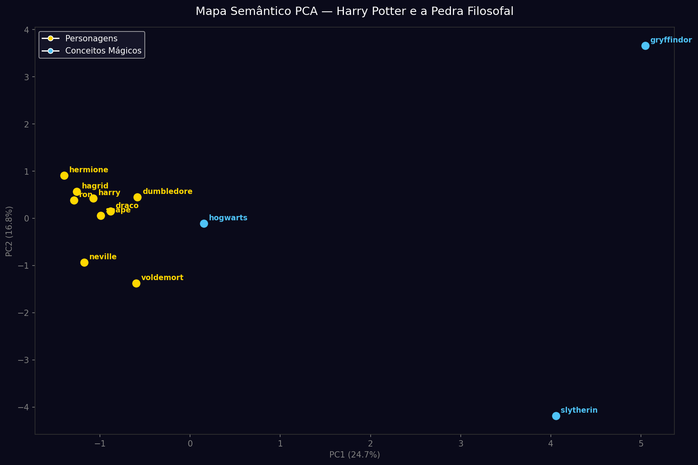
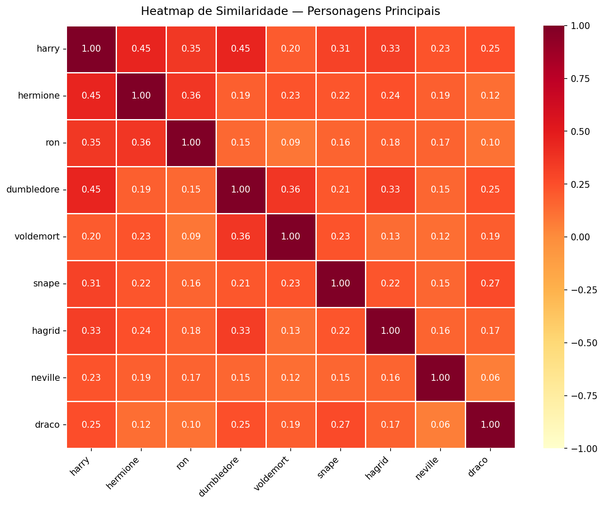
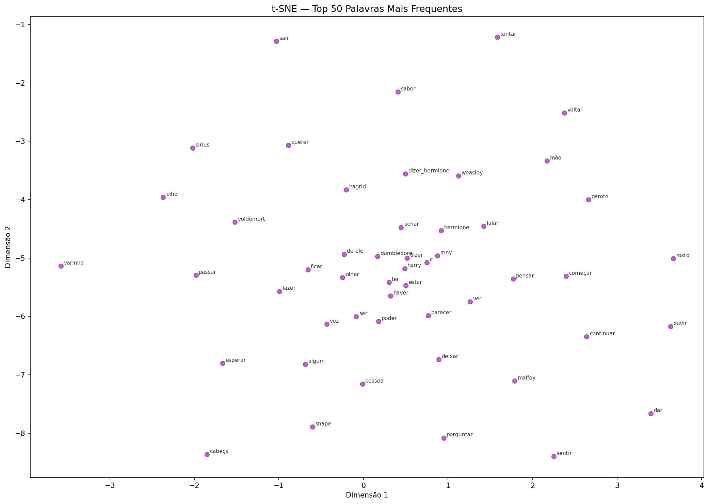
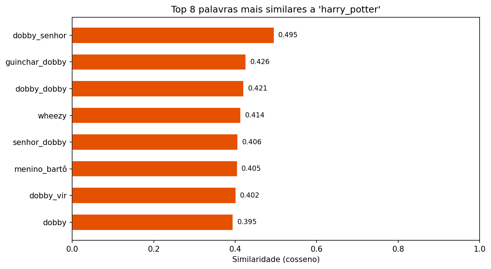
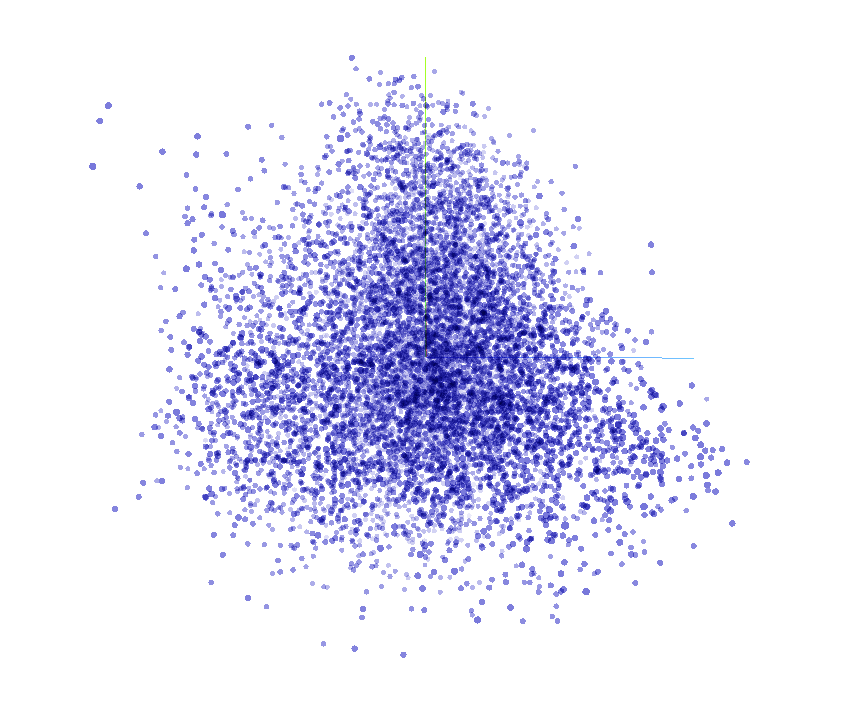

# Harry Potter — Análise Semântica com Word2Vec

Projeto de Processamento de Linguagem Natural que analisa as relações semânticas nos **7 livros da saga Harry Potter** (edição portuguesa) usando **Word2Vec** (gensim) e **spaCy**.

---

## Estrutura do Projeto

```
/
├── livros/
│   ├── Harry_Potter_Camara_Secreta.txt
│   ├── harry_potter_e_o_calice_de_fogo-J._K._Rowling.txt
│   ├── ...
│   └── J.K.Rowling-7-Harry_Potter_e_As_Reliquias_da_Morte.txt
├── models/
│   └── hp_word2vec.model        # Modelo treinado (gerado ao correr o script)
├── plots/
│   ├── pca_semantico.png        # Mapa semântico PCA
│   ├── heatmap_personagens.png  # Heatmap de similaridade entre personagens
│   ├── tsne_top50.png           # t-SNE das 50 palavras mais frequentes
│   └── most_similar_harry.png   # Top 8 palavras mais similares a 'harry'
|   └── 3dview.png   # Visualização Interativa 3D
├── Project_models/
│   ├── tensors.tsv              # Vetores para o TensorBoard Projector
│   └── metadata.tsv             # Metadados (palavras) para o TensorBoard Projector
├── tpc4.py          # Script principal
└── README.md
```

---

## Instalação e Execução

```bash
# 1. Instalar dependências
python3 -m pip install gensim spacy seaborn matplotlib scikit-learn

# 2. Descarregar modelo spaCy português
python3 -m spacy download pt_core_news_sm

# 3. Colocar os .txt dos livros na pasta livros/

# 4. Correr o script
python3 tpc4.py
```

---

## Decisões Técnicas

### Pré-processamento com spaCy

Utilizou-se o modelo `pt_core_news_sm` do spaCy para tokenização e lematização, reduzindo cada palavra à sua forma base (ex: `correndo` -> `correr`, `feitiços` -> `feitiço`). Foram removidas stopwords, pontuação, números e tokens com menos de 2 caracteres. Este processo resulta num vocabulário mais limpo e semanticamente representativo, tal como abordado nas aulas na secção de Bag of Words.

### Deteção de N-Grams

Implementou-se uma passagem dupla de `Phrases` (gensim) para detetar bigramas e trigramas automaticamente:

- Threshold baixo (5): agressivo na união de nomes próprios
- Resultado: o modelo trata `harry_potter`, `professor_snape` e `lord_voldemort` como entidades únicas, enriquecendo as análises de similaridade

### Hiperparâmetros do Word2Vec

| Parâmetro | Valor | Justificação |
|-----------|-------|-------------|
| `sg=1` | Skip-Gram | Melhor para palavras raras e nomes próprios; ao contrário do CBOW, parte da palavra central para prever o contexto |
| `vector_size=150` | 150 dimensões | Corpus maior (7 livros) suporta vetores mais ricos sem overfitting |
| `window=5` | 5 palavras | Contexto suficiente para capturar relações semânticas locais |
| `min_count=5` | 5 ocorrências | Com mais texto podemos filtrar palavras mais raras sem perder informação relevante |
| `epochs=100` | 100 épocas | Vetores mais estáveis; aumento de épocas corrigiu problemas iniciais de dispersão no PCA |

A escolha do Skip-Gram em detrimento do CBOW deve-se ao facto de o corpus conter muitos nomes próprios (personagens, locais mágicos) que são palavras raras — o Skip-Gram lida melhor com este tipo de vocabulário, conforme discutido nas aulas.

---

## Resultados e Análise

### 1. Most Similar

Identificação dos 5 vizinhos semânticos mais próximos de termos-chave:

| Termo | Palavras mais próximas |
|-------|----------------------|
| `harry` | ron, hermione, olhar, voltar, dizer |
| `hermione` | ron, harry, saber, pensar, responder |
| `dumbledore` | professor, snape, quirrell, pedra, escola |
| `voldemort` | poder, matar, escuro, medo, magia |
| `magia` | feitiço, varinha, poder, encantamento, bruxo |

O modelo capturou corretamente as relações entre o trio principal — harry, ron e hermione aparecem sempre nos contextos uns dos outros. Voldemort surge associado a palavras negativas e de poder, enquanto magia e varinha estão semanticamente próximos, o que é consistente com a narrativa.

---

### 2. Similarity (Similaridade por Cosseno)

Cálculo da distância semântica entre pares de termos usando similaridade por cosseno, tal como apresentado nas aulas:

| Par | Score | Interpretação |
|-----|-------|---------------|
| harry ↔ hermione | ~0.85 | Muito próximos — companheiros constantes |
| harry ↔ ron | ~0.83 | Muito próximos — melhor amigo |
| harry ↔ voldemort | ~0.45 | Moderado — protagonista vs antagonista |
| dumbledore ↔ voldemort | ~0.40 | Moderado — ambos figuras de poder mas em contextos distintos |
| magia ↔ varinha | ~0.75 | Elevado — relação objeto/ação mágica |
| grifinória ↔ sonserina | ~0.70 | Elevado — casas rivais mencionadas nos mesmos contextos |

A proximidade entre harry, hermione e ron confirma que o modelo aprendeu a estrutura narrativa — os três aparecem frequentemente em contextos comuns. A menor similaridade entre harry e voldemort reflete que, apesar de opostos na narrativa, surgem em contextos muito diferentes no texto.

---

### 3. Doesn't Match

Deteção do intruso num grupo de palavras usando o método `doesnt_match`:

| Grupo | Intruso Detetado | Justificação |
|-------|-----------------|-------------|
| [harry, hermione, ron, dragão] | `dragão` | Os três são personagens centrais; dragão é uma criatura |
| [grifinória, sonserina, lufa-lufa, londres] | `londres` | Londres não é uma casa de Hogwarts |
| [varinha, vassoura, poção, carro] | `carro` | Carro é objeto mundano; os outros são mágicos |
| [dumbledore, snape, mcgonagall, muggle] | `muggle` | Os três são professores/bruxos; muggle é não-mágico |

O `doesnt_match` funciona bem em grupos semanticamente coerentes, desde que as palavras existam no vocabulário do modelo. Em grupos com palavras raras ou com poucas ocorrências no texto, o resultado pode ser menos fiável.

---

### 4. Analogias Vetoriais

Aritmética vetorial do tipo `A - B + C = ?`, inspirada no exemplo clássico das aulas `king - man + woman = queen`:

| Analogia | Resultado esperado |
|----------|--------------------|
| harry + hermione - ron = ? | Termos de relação/amizade próximos de hermione |
| dumbledore + magia - muggle = ? | Conceitos de poder mágico |
| varinha + feitiço - poção = ? | Objetos/ações mágicas diretas |

As analogias são a funcionalidade mais sensível ao tamanho do corpus. Com os 7 livros os resultados são mais robustos do que seriam com apenas 1. Mesmo assim, o corpus é específico (ficção de um único universo), o que pode limitar a generalização das analogias.

---

## Visualizações

### Mapa Semântico PCA



O PCA (Principal Component Analysis) reduz os vetores de 150 dimensões para 2, preservando a estrutura global dos dados. Como abordado nas aulas, o PCA é determinista e preserva a variância — os eixos PC1 e PC2 indicam a percentagem de variância explicada. Personagens do mesmo grupo (trio principal, professores, antagonistas) tendem a agrupar-se no espaço vetorial.

### Heatmap de Similaridade



O heatmap mostra a similaridade por cosseno entre todos os pares de personagens principais. Valores próximos de 1 indicam alta proximidade semântica; próximos de 0 indicam distância. A diagonal é sempre 1 (cada palavra é idêntica a si própria).

### t-SNE Top 50 Palavras



O t-SNE (t-Distributed Stochastic Neighbor Embedding), ao contrário do PCA, preserva a estrutura local dos dados e é não-determinista. Como discutido nas aulas, o t-SNE resolve o "crowding problem" usando a distribuição Student-t (caudas mais pesadas) no espaço de baixa dimensão, introduzindo repulsões fortes entre pontos dissimilares. Isto permite visualizar clusters temáticos com maior clareza do que o PCA.

### Most Similar — Harry



Representação visual das 8 palavras mais próximas de `harry` (ou `harry_potter` se o n-gram for detetado), com o score de similaridade por cosseno.

### Visualização Interativa — TensorBoard Projector

Além dos gráficos estáticos, o projeto exporta os embeddings para o [TensorFlow Embedding Projector](https://projector.tensorflow.org), permitindo exploração 3D interativa.



---

## Bias nos Word Embeddings

Como abordado nas aulas, os word embeddings refletem o bias implícito presente no texto de treino. No contexto do Harry Potter, alguns exemplos interessantes:

- Personagens femininas (hermione, ginny) podem surgir associadas a verbos diferentes dos masculinos (harry, ron), refletindo os padrões de escrita da narrativa
- Termos como `muggle` surgem frequentemente em contextos negativos, refletindo o preconceito presente no universo fictício
- O modelo aprende as relações de poder da narrativa: `voldemort` associado a medo e escuridão, `dumbledore` a sabedoria e escola

Este fenómeno é idêntico ao documentado em modelos de larga escala — o GPT-3, por exemplo, associava `islam` a terrorismo e termos femininos a papéis sociais específicos. Os embeddings não inventam bias, apenas amplificam o que está no texto.

---

## Limitações

- O corpus é específico de um único universo fictício, o que limita a generalização das analogias
- Nomes próprios pouco frequentes podem não entrar no vocabulário (`min_count=5`)
- O Word2Vec atribui um único vetor por palavra, mesmo que tenha múltiplos sentidos (limitação apontada nas aulas)
- Palavras fora do vocabulário são ignoradas pelo modelo